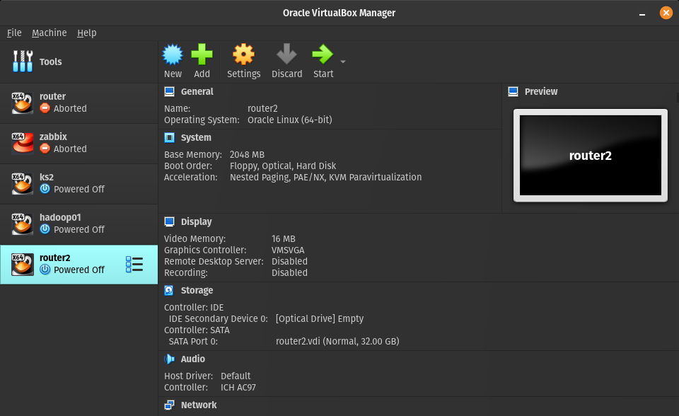
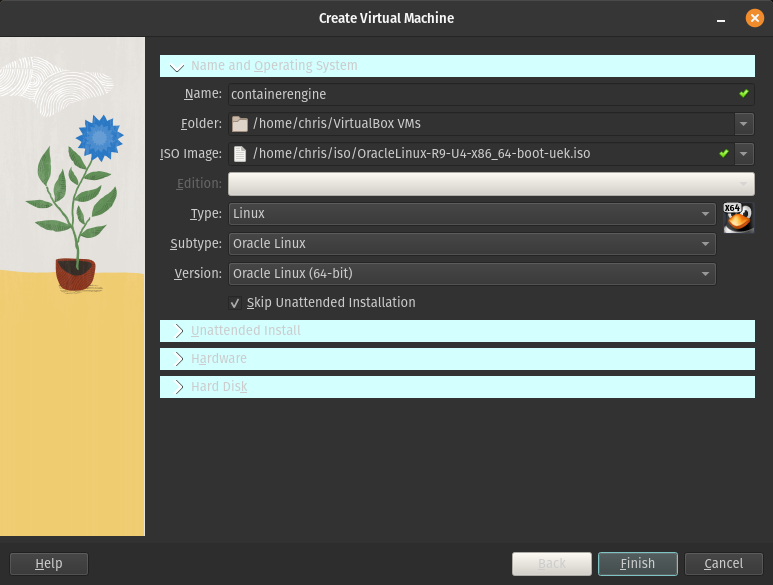
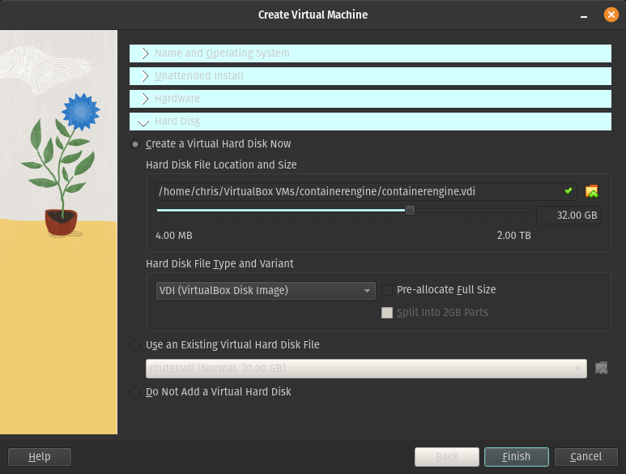
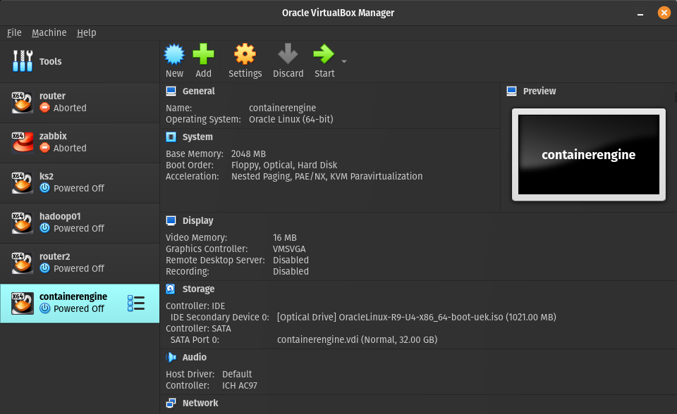
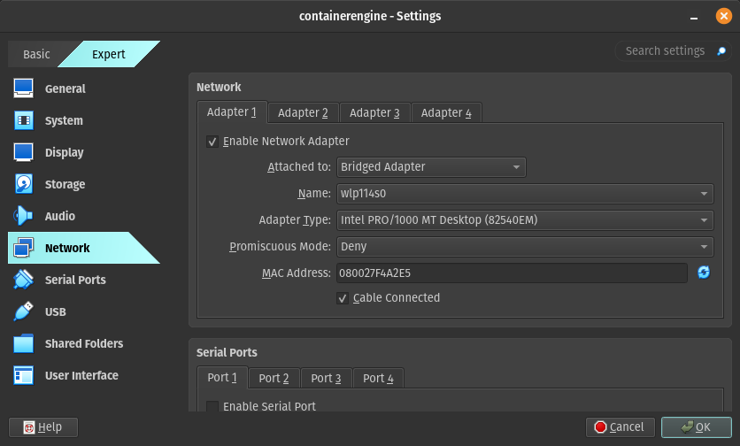
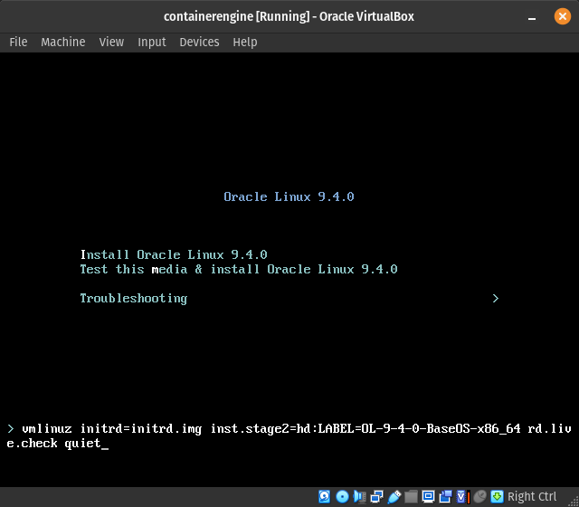
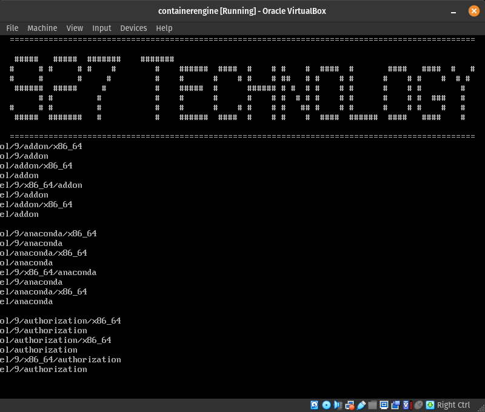

# Onboarding

## Tools
* [VSCode](https://code.visualstudio.com/download)
* [Git](https://git-scm.com/downloads)
* [Docker](https://docs.docker.com/engine/install/rhel/)
* [Docker Compose](https://github.com/docker/compose/releases)
* [VirtualBox](https://www.virtualbox.org/)

### VM Operating System
* [~~Oracle Linux 9~~](https://yum.oracle.com/oracle-linux-isos.html)
* [Rocky Linux 9](https://rockylinux.org/download) - Must be Minimum or Full, not Netboot

### Server Package Dependancies
* jq
* OSQuery
* curl
* wget

### Discord
  * [Group Chat](https://discord.gg/QkYG42UT)
  * [Group Server](https://discord.gg/wMRevqJp)

---

### I dont want to break anything, what can I mess with?

Everything!

Break the OS?  Redeploy!

Break the Container?  Pull it again!

Remember this is a "Pets vs Cattle" setup.  This meanins the system is not a "Pet" or something we care about and take care of.  Its a "Cow" which we slaughter when we want a STEAK!


## Building a Dev Environment
VM build is done with a ~~Oracle~~ Rocky Linux 9 instance that is automated by kickstart.  [927 Kickstart](https://github.com/927technology/kickstart) provides the automation.

Container Server changed to Rocky Linux 9 due to issues with Oracle Linux 9 kickstart.  Rocky will be the container engine OS for now until Oracle kickstart issues are resolved.  Some documentation may say Oracle, but Rocky is a reliable fork of the EL standard and should be a exact replacement.

### Provision VM
* Install your Type II hypervisor of choice.  Virtualbox is demonstrated.
* Download the ~~Oracle~~ Rocky Linux 9 ISO file
* Create a new VM in VirtualBox

* Name and Operating System
  - Name = Whatever you would like to use
  - Folder = Default location for your system
  - ISO Image = Path to the ~~Oracle~~ Rocky Linux 9 ISO you downloaded
  - Editon = \<blank>
  - Type = Linux (this should auto populate)
  - Subtype = Oracle Linux (this should auto populate)
  - Version = Oracle Linux (64-bit) (this should auto populate)
  - Skip Unattended Installation = Checked

* Hard Disk
  - Ensure hard disk size is >= 32GB

* Finish

### Configure VM Network
To make it simpler to access our web interface, we will place the VM in the Bridged network.
* Select your VM and press Settings

* Select Network
* Changed Attached to = Bridged Adapter

* OK


### Boot the VM
* Select your VM and press Start
* A VM console windown will open and begin booting the Oracle Linux 9 CD
* Place your mouse in the console window (the black part) and left click
* Virtual box will capture your mouse.  Press the right \<ctrl> button to release the cursor at any time.
* While your mouse is captured, press \<tab> when the ~~Oracle~~ Rocky Linux 9 Boot menu is present.

* Append the following to the end of the prompt

```
inst.ks=https://raw.githubusercontent.com/927technology/kickstart/main/distro/el/docker.ks

```

* Final command should look like

```
> vmlinuz initrd=initrd.img inst.stage2=hd:LABEL=OL-9-4-0-BaseOS-x86_64 rd.live.check quiet inst.ks=https://raw.githubusercontent.com/927technology/kickstart/refs/heads/main/distro/el/docker.ks


```
* \<enter>
* The automated installation will begin

* VM will install and reboot


### Using the Dev VM
* Login to the VM
  - user: root
  - password : 1qaz2wsx!QAZ@WSX
* Validate the VM is fully patched
  
  ```
  yum check-update
  yum update -y
  ```

* Validate Container Engine is running
  
  ```
  systemctl status docker
  ```

* Pull the 927 Ops container from DockerHub

  ```
  docker pull 927technology/ops:latest
  ```

* Show your local docker images
  
  ```
  docker images
  ```
* Enable root SSH
  ```
  echo PermitRootLogin yes >> /etc/ssh/sshd_confg
  systemctl restart sshd
  ```

* Get your IP address
  ```
  ip --json address show dev enp0s3 | jq -r '.[].addr_info[] | select(.family=="inet").local'
  ```

* Get the Ops Container Start Script
  ```
  curl -s -o ~/run.sh https://raw.githubusercontent.com/927technology/ops/refs/heads/main/run.sh 
  chmod +x ~/run.sh
  ```

* Start and enter the Container
  ```
  ~/run.sh
  ```

* Start the Ops Engine
  ```
  /usr/local/bin/entrypoint.sh
  ```

* Stop the Ops Engine
  ```
  <ctrl>c
  ```

* Directories of note
  
  |||
  |-|-|
  |/etc/naemon|root config folder for the naemon server| 
  |/etc/naemon/conf.d|configuration folder for the naemon server|
  |/usr/local/lib/bash/0.4.0|bash libraries v0.4.0 from 927 technology|
  |/usr/local/bin|executable files fo rthe ops engine|
  |/usr/lib64/naemon/plugins|executable files used by naemon|

* Accessing Naemon
  * open your web browser and go to http://\<vm ip address>/thruk
  * Login
    - user: thrukadmin
    - password: thrukadmin

  * You will see failures in service checks until you obtain your certificates to access OCI at a later time.


## Install Guest Addtions - Not Required
* From the console window select Devices > Insert Guest Addtions CD Image


```
yum install -y epel-release
yum check-update
dnf install kernel-headers dkms gcc make kernel-devel bzip2 binutils patch libgomp glibc-headers glibc-devel -y

mount /dev/cdrom /mnt
/mnt/VBoxGuestAdditions.run
```

## Create Secrets
* Secrets have been moved to a secret store
* Contact me to get the info